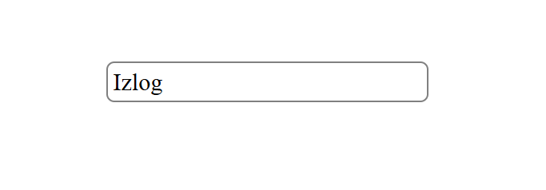
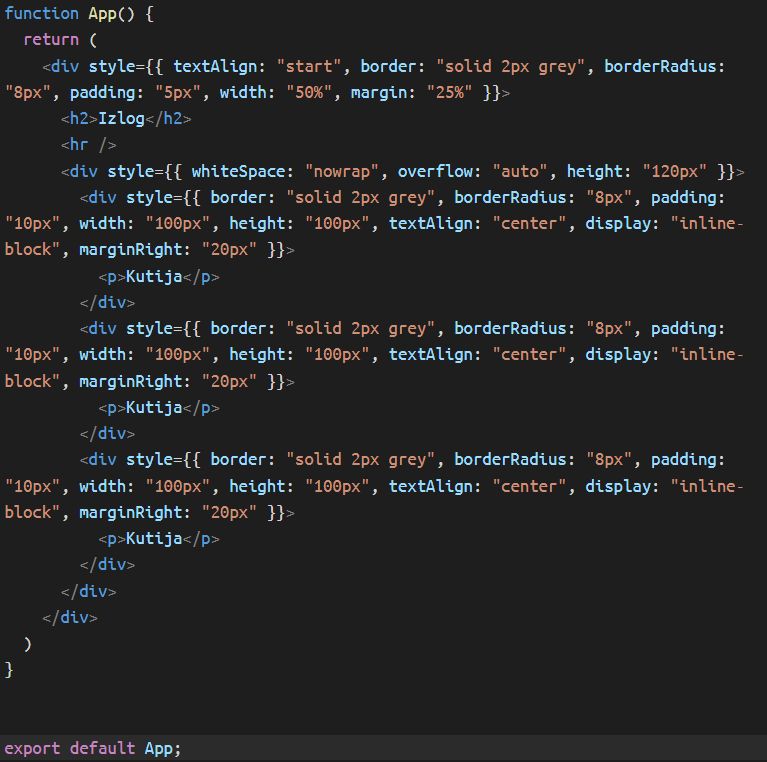
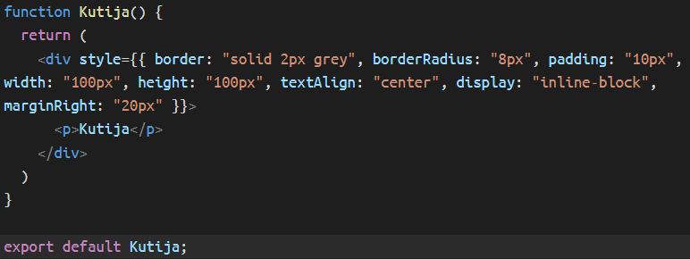
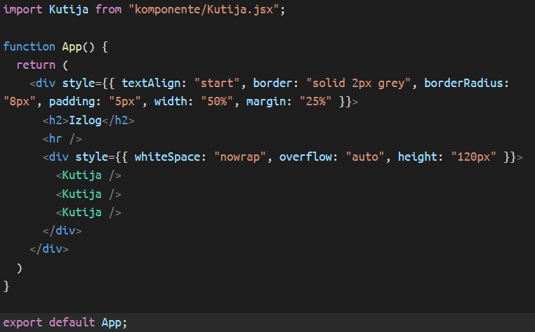
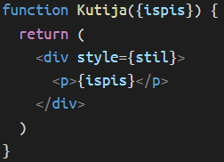
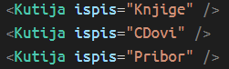
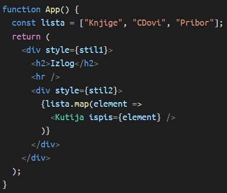

# Stan.co

Projekt iz kolegija Programsko inženjerstvo

## Sadržaj

* [Instalacija](#instalacija)
* [MERN arhitektura](#mern-arhitektura)

## Instalacija

#### Potrebni programi

* [Node.js](https://nodejs.org/en/download/)
  - Potrebno skinit npm!
* [MongoDB Server](https://www.mongodb.com/try/download/community)
* [MongoDB GUI](https://www.mongodb.com/try/download/compass)

#### Preuzimanje projekta

```powershell
mkdir stanco
cd stanco
git init
git remote add origin https://github.com/LukaGrbelja/Stan.co.git
git pull origin master
```

#### Preuzimanje potrebnih paketa

```powershell
cd frontend
npm install
cd ../backend
npm install
```

#### Uspostavljanje lokalne baze podataka

1. MongoDB Compass => Add new connection
2. Podatci
   - URI : mongodb://localhost:27017/
   - Name : ProgInz

> [!NOTE]
> Kolekcije (tablice) bi se tribale upisat same prilikom prvotnog korištenja.

#### Pokretanje

* Potrebna su dva različita terminala: jedan za pokretanje react aplikacije (frontend), a drugi za uspostavljanje express servera (backend)
* Ovisno u koju se mapu uđe koriste se naredbe:
  - Frontend: `npm run dev`
  - Backend: `npm start`

## MERN arhitektura

* [Uvod](#uvod)
* [React](#react)
* [Express.js](#expressjs)
* [MongoDB](#mongodb)
* [Komunikacija](#komunikacija)
* [Materijali](#materijali)

> [!NOTE]
> TODO: kad se uspostavi pravi server i online baza podataka triba konfigurirat env varijable.

### Uvod


Komponente arhitekture

* Frontend
  - Komunicira s korisnikom (zabilježava akcije)
  - Stvara upit
  - Prikazuje primljene podatke
* Backend
  - Prima upite
  - Traži i prosljeđuje podatke

Ostvarivanje komunikacije

* Axios
  - Frontend-Backend komunikacija
  - Radi na HTTP upitima
* Mongoose
  - Backend-Database komunikacija

### React

* JavaScript biblioteka
* Dijeli kod na komponente
  - Smanjena redudantnost
  - Olakšano snalaženje
* Koristi JSX (JavaScript XML)
  - Omogućava korištenje HTML koda
  - Malo drukčiji od običnog JavaScript koda
* React sam mijenja DOM
  - DOM se ne mijenja ručno (hvatanjem elemenata)
  - U kodu se opisuje prikaz aplikacije u određenom stanju
  - React automatski ažurira prikaz ovisno o akcijama korisnika

#### Komponente

* JavaScript funkcija s dodjeljenim HTML kodom

###### Jednostavan primjer

| Primjer komponente   | `function App() {`<br />`	return(`<br />`		<h1>Naslov</h1>`<br />`	);`<br />`}`                                                                     |
| :------------------- | :------------------------------------------------------------------------------------------------------------------------------------------------------------ |
| Prikaz               |                                                                                  |
| Objašnjenje         | Komponenta u kodu izgleda kao obična funkcija<br />U return parametar se upisuje dodijeljen HTML kod<br />Prije return naredbe se zapisuje logika komponente |
| Alternativni pristup | `function App() {`<br />`	let ispis = "Naslov";`<br />`	return(`<br />`		<h1>{ispis}</h1>`<br />`	)`<br />`}`                                     |
| Objašnjenje         | Prikaz ostaje isti<br />Varijable i vrijednosti iz logičkog dijela se u HTML kodu dodaju u vitičastim zagradama                                             |

> [!NOTE]
> Logički dio komponenti je potreban za reakcije na akcije korisnika, komunikaciju s backend stranom i  formiranje podataka te se može zaobić kod komponenti koje služe samo za osnovni prikaz (praktički statičke komponente).

| Primjer komponente | `function App() {`<br />`	return(`<br />`		<div style={{`<br />`			textAlign: "start",`<br />`			border: "solid 2px grey",`<br />`			borderRadius: "8px",`<br />`			padding: "5px",`<br />`			width: "50%",`<br />`			margin: "25%"`<br />`		}}>`<br />`			<h2>Izlog</h2>`<br />`		</div>`<br />`	);`<br />`}` |
| :----------------- | :----------------------------------------------------------------------------------------------------------------------------------------------------------------------------------------------------------------------------------------------------------------------------------------------------------------------------------------- |
| Prikaz             |                                                                                                                                                                                                                                                               |
| Objašnjenje       | Element h1 je obuhvaćen div elementom<br />Komponenti je dodan stil tako da je formatiran u obliku objekta                                                                                                                                                                                                                                |

##### Korištenje komponente u React projektu

Datoteka `App.jsx` sadrži komponentu `App` za koju se može reći da je izvorna komponenta.
Komponenta `App` se renderira na stranici pomoću funkcije render.
Sam kod ispisa može se vidit u datoteci `main.jsx`.

###### Rad među datotekama

Komponenta se definira u jednoj datoteci, a poziva u drugoj.
To je omogućeno ako je vrijednost atributa `type` elementa `script` postavljena na `"module"`.

| App.jsx              | `export default App;`<br />Ili<br />`export { App };`                           |
| :------------------- | :---------------------------------------------------------------------------------- |
| main.jsx             | `import App from './App.jsx';`<br />Ili<br />`import { App } from './App.jsx';` |
| Pozivanje komponente | Upisuju se u HTML kod kao HTML elementi.                                            |

###### Primjer korištenja

| Kod                                                                        | Prikaz                                                                        |
| :------------------------------------------------------------------------- | :---------------------------------------------------------------------------- |
|  |  |

> [!WARNING]
> Vidimo da se jedan HTML element ponavlja više puta.
> Za taj element može se koristit jedna komponenta.

| <br /> |  |
| :--------------------------------------------------------------------------------------------------------------------------------------------------------- | :---------------------------------------------------------------------------- |

> [!NOTE]
> HTML kod se nemora ponavljat da bi ga se stavilo u komponentu, može biti bilokakvi dio koda s zasebnim značenjem (navigacijska traka, forma za pretraživanje ili bilo koji veći dio koda). Zapravo se svaki dio koda može stavit kao komponenta, čak i oni najmanji kao elementi p, h2 ili span, ali poanta je da se smanji ponavljanje koda, omogući bolje snalaženje i organizacija. Stvaranje previše malih komponenti otežava razumjevanje koda tako da triba naći granicu između onoga šta triba stavit u komponente i šta ne.
>
> * [Dodatno](https://react.dev/learn/importing-and-exporting-components)

> [!WARNING]
> Stilska svojstva su ovdje stavljena u kod samo radi lakšeg razumjevanja demonstracije.
> Bolja praksa bi bilo koristit vanjsku CSS datoteku (može biti čak zasebna CSS datoteka za svaku JSX datoteku) ili napraviti JS/JSX datoteku koja sadrži objekte s vrijednostima stilskih svojstava koji se pomoću export / import naredbi dovedu do JSX datoteke i umetnu u vrijednost style atributa.

##### Parametri komponente

* Kao što funkcije imaju parametre tako ih imaju i komponente.
  - U Reactu se oni nazivaju props
* Za razumit možda bi najlakše bilo reć da koristimo parametre ako želimo ispisat iste komponente s različitim vrijednostima, odnosno različite tekstove s istim okruženjem.
* U definiranju komponente odlučuje se što se radi s parametrima odnosno gdje se koriste, a u pozivanju se određuje njihova vrijednost.

###### Primjer

| Kod                                                                                                                                                        | Prikaz                                                                        |
| :--------------------------------------------------------------------------------------------------------------------------------------------------------- | :---------------------------------------------------------------------------- |
| <br /> |  |

> [!NOTE]
> U primjeru se direktno parametri razlažu u vrijednosti, ali također je moguće da funkcija prima samo jedan objekt props što bi izgledalo kao: `function Kutija(props) {`. Taj objekt bi kao atribute imao definirane parametre.

Ovo se može naparviti na način da se još koda skrati. Objašnjenje je trivijalno.

|  |  |
| :------------------------------------------------------------------------- | :---------------------------------------------------------------------------- |

* [Dodatno](https://react.dev/learn/rendering-lists)

#### Stanje

Za sad su korištene varijable koje imaju konstantu vrijednost odnosno koje su korištene samo za prikaz.
Ali ako su potrebne varijable koje mijenjaju vrijednost potrebno je koristiti stanje (`useState`).

```javascript
import { useState } from "react";
...
	const [state, setState] = useState(0);
```

U useState se može upisati bilo koji tip vrijednosti.
Vrijednost stanja se nalazi u varijabli `state`, a u varijabli `setState` je spremljena setter funkcija pomoću koje se definira nova vrijednost stanja.

###### Načini mijenjanja stanja

```javascript
// Integer
const [intState, setIntState] = useState(0);
setIntState(10);// novo postavljanje
setIntState(previousValue => previousValue + 1);// relativna promjena i povecavanje, bolja metoda
setIntState(intState + 1);// same, razlika je u izvođenju, you'll see

// Object
const [objState, setObjState] = useState({
	value: 0,
	description: ""
});
setObjState({
	...objState,
	value: objState.value + 5
});// Zašto ovod ne radi arrow funkcija? Pitaj Boga

// Array
const [arrState, setArrState] = useState([0,1,2,3,4]);
setArrState(prevState => [ ...prevState, 5 ]);
```

> [ERROR]
> Nikad ne stavljati setter funkciju slobodnu u logičkom dijelu nego samo kao odgovor na neki akciju korisnika ili drugi event. Odnosno setter funkcija mora biti uvjetna po nećemu inače će srušit aplikaciju. Objašnjenje u idućem dijelu.

###### Zašto stanje umjesto varijable

Glavno svojstvo React okruženja je automatsko mijenjanje DOM vrijednosti.
React uzima sve komponente, izvršava logičke djelove i iscrtava HTML elemente.
Ali React to ne radi konstantno, nego to napravi na početku i čeka neku (jednu od više načina) naredbu koja ga tjera da ponovo iscrta stranicu.
Svojstvo stanja je da se svakom njegovom promjenom stranica opet iscrtava.

Ali stanje se također sprema u unutarnju memoriju React komponente (model) i svakom promjenom se mijenja i vrijednost u modelu.
Isto ne vridi za varijablu, tako da ako bi pokušali mijenjat i koristit varijablu React bi ponovnim iscrtavanjem uzea prvotnu vrijednost definiranu pri inicijalizaciji varijable.
Dok bi za stanje ignorirao onu vrijednost u incijalizaciji korištenjem `useState` funkcije i uzea vrijednost iz modela.

Jednostavno prihvati (Betti type shit) ili pričekaj objašnjnje o MVC arhitekturi i istraži Virtual DOM.

#### Napredni koncepti

* [MVC](https://javascript.plainenglish.io/mvc-architecture-in-react-a-simple-guide-to-structure-and-organization-b2643b8be81f)
  - [Dodatno](https://stackoverflow.com/questions/53729411/why-isnt-react-considered-mvc)
* [Virtual DOM](https://www.geeksforgeeks.org/reactjs/reactjs-virtual-dom/)
* [React hooks](https://www.w3schools.com/react/react_hooks.asp)
* [React router](https://reactrouter.com/start/declarative/routing)
* [Generalna react arhitektura](https://devshi-bambhaniya.medium.com/a-complete-guide-to-react-architecture-patterns-ea386d2ba327)

### Express.js

* Okvir za izradu servera
* Napravljen na Node.js alatu
  - Praktički omogućava pokretanje JavaScript koda van preglednika
  - Za razliku od preglednika manje je fokusiran na DOM manipulaciju, a više na logiku podataka
* Dodaje sloj jednostavnosti i olakšava rad servera u usporedbi s Node.js alatom
* Server sluša za nadolazeće zahtjeve (request)
  - Za to određuje port i IP adresu
  - Vraća podatke kroz odgovor (response)
  - [Objašnjenje](https://stackoverflow.com/questions/70384927/what-does-the-listen-method-in-express-look-like)
* Dijeli se na rute
  - Svakoj ruti je dodjeljena putanja i kod
  - Po putanji se identificiraju različiti zahtjevi na server
* Temelji se na obradi i formiranju HTTP paketa
  - Kod koji se izvršava je funkcija s objektima zahtjeva i odgovora

###### Primjer osnovnog express servera

* Sam server predstavlja varijabla `app` i dodjeljen je funkcijom `express()`

```javascript
import express from "express";

const app = express();
const PORT = 3000;

// Primjer rute
app.get("/", (req, res) => {
	// Neki kod
});

app.listen(PORT);// Server sluša na http://localhost:3000
```

#### Node.js arhitektura

1. Primanje zahtjeva
2. Event queue
   - Sprema zahtjeve i prosljeđuje ih po redosljedu
3. Event loop
   - Određuje mogu li se zahtjevi odma početi izvršavati
   - Ako zahtjev blokira proces negdje u kodu (recimo korištenjem vanjskih resursa) dodjeljuje mu se thread
     - Kad se blokirajuća akcija obavi zahtjev se vraća u event loop
   - Ako ništa više ne blokira proces, zahtjev se obrađuje i šalje se odgovor

#### HTTP metode i zahtjevi

##### Zahtjev i odgovor

* Zahtjev - objekt `req` koji predstavlja posatke koje klijent šalje serveru
  - method - HTTP metoda
  - url    - putanja zahtjeva
  - params - varijabilne URI vrijednosti
  - query  - vrijednosti koje se nalaze na kraju URI stringa poslije upitnika
  - body   - podatci poslani u tijelu zahtjeva
* Odgovor - objekt `res` koji predstavlja podatke koje server šalje klijentu
  - status - postavlja HTTP statusni kod
  - send - metoda koja šalje tekstualni odgovor
    - obično opisuje status odgovora
  - json - šalje podatke u JSON formatu
  - redirect - preusmjerava na drugu rutu

##### HTTP metoda

* GET - Koristi se za zahtjeve gdje se traži određeni podatak
  - Zahtjev bi samo triba samo vraćat podatke
  - Nesmije sadržavati podatke osim query vrijednosti za pronalazak podataka
* POST - Koristi se za dodavanje novih podataka
  - Zahtjev ne smije sadržavati query vrijednosti nego samo u tijelu zahtjeva
* PATCH - Koristi se za djelomičnu izmjenu podataka
  - Sadrži podatke u tijelu zahtjeva
* DELETE - Briše određene podatke
  - Sadrži podatke o elementima kao query vrijednosti

#### Rute

* Rute određuju što se događa kad klijent pošalje zahtjev na određenu URI
  - putanja - objasni
    - statična - uvijek ista
    - dinamična - sadrži parametre
  - HTTP metodu
  - funkciju - ona prima `req` i `res` objekte i izvršava se kad dođe zahtjev na njoj dodjeljenu putanju

##### Modularnost

* U slučaju prevelikog broja ruta mogu se podijeliti u više datoteka

```javascript
// server.js
import express from "express";
import userRouter from "./router/userRouter.js";
const app = express();

app.get("/testRuta", (req, res) => {
	res.send("Test uspješan!");
});

app.use("/", userRouter);

app.listen(3000);
```

```javascript
// userRouter.js
import { Router } from "express";

const userRouter = Router();

userRouter.post("/login", (request, response, next) => {
    // Neki kod
});

userRouter.post("/signup", (request, response, next) => {
    // Neki kod
});

export default userRouter;
```

#### Napredni koncepti

* [Ispravljanje grešaka](https://dev.to/wallacefreitas/error-handling-in-nodejs-patterns-and-practices-1mg0)
* [Middleware](https://www.w3schools.com/nodejs/nodejs_middleware.asp)
* [Asinkrono programirajne](https://patchmycode.com/async-programming-in-node-js-a-complete-guide/)
* [Objekt zahtjeva](https://developer.mozilla.org/en-US/docs/Web/API/Request)
* [Event emmiter](https://nodejs.org/en/learn/asynchronous-work/the-nodejs-event-emitter)

### MongoDB

* NoSQL baza podataka
  - podaci se spremaju u JSON obliku
* Struktura
  - Dokument - zapis, entitet, praktički objekt
  - Kolekcija - skup dokumenata, ekvivalent tablici
  - Baza podataka - skup kolekcija
* Prednosti
  - Za razliku od SQL tablica, dokumenti nisu potpuno određeni i fleksibilni su
  - Kompatibilna s JavaScript programskim jezikom zbog korištenja JSON formata

### Komunikacija

#### Axios

* Uspostavlja komunikaciju među frontend i backend dijelovima aplikacije
* Pomoću određene HTTP metode šalje zahtjev na određenu rutu na backendu
* Format: `axios.method("url" + "routePath")`
* Prima nazad odgovor te ga može obrađivati sinkrono ili asinkrono

```javascript
// Sinkrono
try {
	const response = await axios.get("http://localhost:3000/users");
	doSomethinWithData(response.data);
}
catch(error) {
	console.error(error);
}
```

```javascript
// Asinkrono
axios({
    method: "GET",
    url: "http://localhost:3000/users"
})
.then(response => response.data)
.then(data => doSomethinWithData(data))
.catch(error => console.error(error));
// Ili
axios.get("http://localhost:3000/users")
.then(response => response.data)
.then(data => doSomethinWithData(data))
.catch(error => console.error(error));
```

##### Slanje podataka

```javascript
// Dodavanje parametara
axios.get("http://localhost:3000/users/123"); // Ali ruta triba imat izgled "/users/:id"

// Dodavanje query vrijednosti
axios.get("http://localhost:3000/users", {
	params: { id: 123 }
});
//Ili
axios.get("http://localhost:3000/users?id=123");

// Dadavanje podataka u tijelo zahtjeva
axios.post("http://localhost:3000/users", {
	id: 124,
	name: "Mate Matić",
	email: "matematic@gmail.com"
});

```

#### Mongoose

* Object Data Modeling bibliteka za MongoDB i Node.js
* Uspostavlja komunikaciju između backend dijela aplikacija i baze podataka
* Omogućuje rad s JavaScript objektima

##### Stvaranje veze

* Koristi se `connect` metoda za spajanje i `connection` objekt za provjeru veze.

```javascript
import mongoose from 'mongoose';
const { connect, connection } = mongoose;

connect("mongodb://localhost:27017/db", {
    serverSelectionTimeoutMS: 5000,
});

connection.on("connected", () => {
  console.log("Mongoose je spojen na MongoDB");
});

connection.on("error", (err) => {
  console.error("Greška u Mongoose vezi:", err);
});

connection.on("disconnected", () => {
  console.log("Mongoose veza je prekinuta");
  // Ovod se može pokušat popravak veze
  // Pogledaj backend/src/database/connection.js
});
```

##### Formatiranje podataka

* Schema je mongoose klasa koja opisuje strukturu dokumenta (zapisa u kolekciji)
* Kreira se pomoću objekta
  - atributi predstavljaju polja tablice
  - svakom atributu se dodaju svojstva poput tipa, default vrijednosti, obaveznosti, jedinstvenosti...

```javascript
const userSchema = new mongoose.Schema({
	name: String,
	email: { type: String, unique: true },
	age: Number
});
```

##### Rad s podatcima

* Za rad s podatcima se koristi mongoose klasa model
  - Instanca sheme
  - Stvara kolekciju prvim korištenjem
* Model sadrži metode za rad s kolekcijama
  - Stvaranje dokumenta - `create()` i `save()`
  - Pronalazak dokumenta - `find()`
  - Brisanje dokumenata - `deleteMany()`
  - Ažuriranje dokumenta - `updateMany()` i `replaceOne()`

### Materijali

* MERN
  - [MongoDB uvod](https://www.mongodb.com/resources/languages/mern-stack?msockid=2d2b8c873ecd64803f1499b83f7c6532)
  - [Preporučen tečaj](https://juniordev-express.netlify.app/react)
  - [Meni jedan od dražih kanala](https://www.youtube.com/@PedroTechnologies/search?query=mern)
  - Primjeri projekata uzlazno po složenosti
    - [1.](https://github.com/ali-jabbari/clean-mern-stack-project/tree/main)
    - [2.](https://github.com/fullsnacker/clean-mern-crud)
    - [3.](https://github.com/aliakseiherman/mern-multitenancy/tree/master)
* React
  - [Službeni program učenja](https://react.dev/learn)
  - [Službena dokumentacija](https://react.dev/reference/react)
    - [Stara verzija](https://legacy.reactjs.org/docs/getting-started.html): možda bi čak prije preporučia za početnike
  - [Primjer](https://github.com/bespoyasov/frontend-clean-architecture/tree/master)
* Node.js
  - [Službeni program učenja](https://nodejs.org/en/learn/getting-started/introduction-to-nodejs)
  - [Službena dokumentacija](https://nodejs.org/docs/latest/api/documentation.html)
* Express.js
  - [Službeni uvod](https://expressjs.com/en/starter/installing.html) (priskoči)
  - [Službena dokumentacija](https://expressjs.com/en/5x/api.html)
  - [Bolji tutorial](https://www.javascripttutorial.net/express-tutorial/)
  - Primjeri
    - [1.](https://github.com/xaviernouaille/express-clean-architecture/tree/main)
    - [2.](https://github.com/Z3r0J/nodejs-clean-architecture/tree/main)

## Struktura projekta

```md
Stan.Co/
├── frontend/src/
│ ├── App.jsx	# Osnovna komponenta React aplikacije koja se rendera i sadrži sve ostale uvezene sadržaje
│ ├── pages/	# Sadrži komponente koje prikazuju određene stranice 
│ ├── components/	# Sadrži komponente koje stranice koriste
│ | ├── main/	# Komponente koje određuju izgled ukupnog sadržaja i organizacije stranice odnosno ukupne aplikacije
│ | ├── elements/	# Komponente koje predstavljaju određene HTML elemente
│ ├── contexts/
│ ├── assets/
│   ├── pictures/
│   ├── styles/	# Sadrži CSS datoteke određenih stranica i komponenti
├── backend/src/
  ├── server.jsx	# Ulazna točka, odnosno misto di se aktivira cili server i veza s bazom podataka
  ├── api/	# Sadrži datoteke koje se bave primanjem zahtjeva i odgovaranjem klijentu
  | ├── index.js	# Datateka na kojoj se definira server i sve njegove komponente
  | ├── routes/	# Sadrži datoteke koje određuju rute na koje klijent može slati zahtjeve
  | ├── controllers/	# Sadrži datoteke koje se bave obradom primjenih zahtjeva i pripremanju odgovora
  | ├── middlewares/	# Sadrži datoteke s dodatnim funkcijama među zahtjeva i odgovora
  ├── database/	# Sadrži datoteke koje se bave primanjem zahtjeva i odgovaranjem klijentu
  | ├── interactors/	# Posrednički sloj koji određuje koja se usluga koristi
  | ├── mongodb/
  |   ├── connection.js	# Datoteka na kojoj se uspostavlja veza s bazom podataka
  |   ├── models/	# Sadrži datoteke u kojima se definira struktura podataka u kolekcijama odnosno schema i model klase
  |   ├── repos/	# Sadrži datoteke koje se bave konkretnim upitima na bazu
```